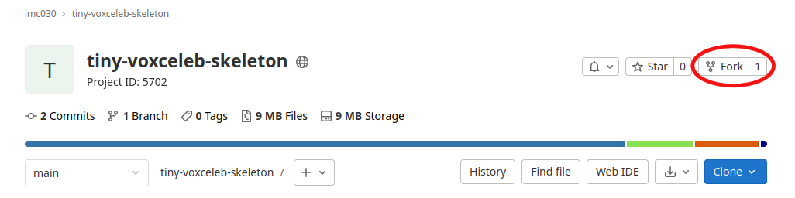
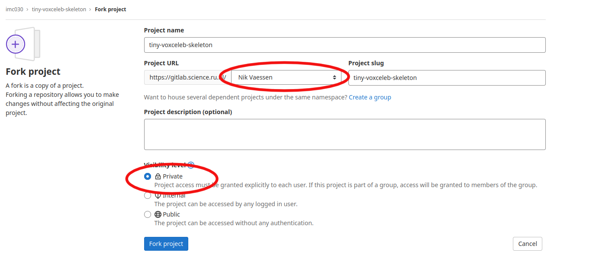
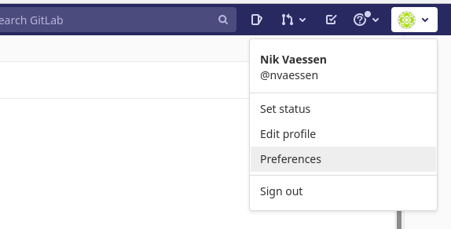
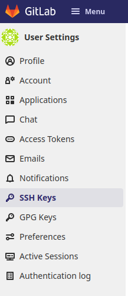
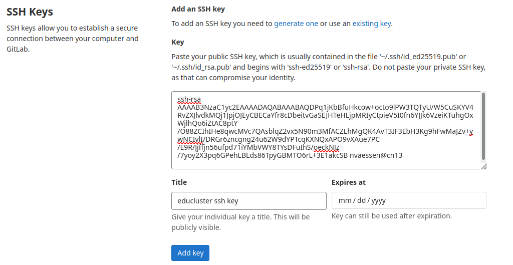
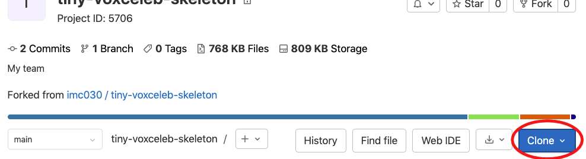

## Setting up the cluster environment

It is handy to have a central repository for the code that your team is working on.  You can easily do this by _forking_ the repo directly from science.ru gitlab.

### Forking the repository on science.ru Gitlab

1. On the [main gitlab page](https://gitlab.science.ru.nl/imc030/tiny-voxceleb-skeleton-2023) of this repo, click the _fork_ button



2. Select the name space (your name), select _Private_ (for now, we don't want other teams to read your clever code), and click _Fork project_. 




Now you have your own version of the skeleton code, that you can share among your team members, by adding them through _Project information..._, _Members_. 

Each member, before they can clone this forked repo to their local computer or to the cluster, needs to be able to access Gitlab.  The instructions below guide you through the process of getting the authentication set up for this. 

### Setting up an SSH key in order to clone your copy of the repo

First, if you have never done so for the machine you're working on (your local computer or the cluster), generate a public/private key pair:

```
$ ssh-keygen 
## and hit <return> a few times
```

Also put the newly generated key in `~/.ssh/authorized_keys`.

```
cat ~/.ssh/id_rsa.pub >> ~/.ssh/authorized_keys
```

Then, print your public key in the terminal and copy it to the clipboard:

```
$ cat ~/.ssh/id_rsa.pub
```

**DO NOT** copy `~/.ssh/id_rsa`, this is your private key!

The output should like the following.
```
ssh-rsa AAAAB3NzaC1yc2EAAAADAQABAAABAQDPq1jKbBfuHkcow+octo9lPW3TQTyU/W5CuSKYV4RvZXJlvdkMQj1JpjOJEyCBECaYfr8cDbeitvGaSEJHTeHLjpMRIyCtpieV5I0fn6YJJk6VzeiKTuhgOxWjlhQo6iZtAC8ptY/O88ZCIhIHe8qwcMVc7QAsblqZ2vx5N90m3MfACZLhMgQK4AvT3IF3EbH3Kg9hFwMaJZv+ywNCIvlI/DRGr6zncgng24u62W9dYPTcqKXNQxAPO9vXAue7PC/E9R/Jjffjn56ufpd71iYMbVWY8TYsDFuIhS/oeckNJz/7yoy2X3pq6GPehLBLds86TpyGBMTO6rL+3E1akcSB nvaessen@cn13
```

Now, in your browser, visit [gitlab.science.ru.nl](https://gitlab.science.ru.nl) and:

1. Navigate to your preferences.



2. Go to the ssh keys tab



3. Paste the public ssh key in the form and click `add key`.



You can repeat this process of adding an ssh-key for each computer from which you want to have access to the repository.  

### Cloning

Now, if you want to clone this repo to the cluster, log on to the cluster node `cn84` (through VPN or via `lilo`).  If you want to clone to a local computer, open a local shell.  

You can copy the exact URL for cloning by clicking the _Clone_ button on your own repository:



and press the _Copy to clipboard_ button to the right of the SSH-address that starts with `git@gitlab.science.ru...`

Then, in the Linux shell type these commands

```bash
$ mkdir mlip
$ cd mlip
$ git clone git@gitlab.science.ru.nl:$sciencelogin/tiny-voxceleb-skeleton-2023.git ## paste the URL here
$ cd tiny-voxceleb-skeleton-2023
```

You can also add the upstream repository (instead of your fork) by using the following command. This might be useful if you want to pull some changes/bugfixes.

```
git remote add upstream git@gitlab.science.ru.nl:imc030/tiny-voxceleb-skeleton-2023.git
```

If you've followed the instructions so far, you can pull or push code from your fork by using

```
git pull origin main # this pulls the branch 'main' from remote `origin`  
```

while the remote `upstream` points to the original, skeleton code you forked. You can check all remotes added to a git repo by using the command:

```
git remote -v
```

### Setting up links and virtual environments in the cluster

If everything is all right, you have a reasonable clean set of files and directories upon first checkout (we will from now on drop the command prompt `$` in the example code):
```bash
ls
```
Now run the script for setting up the virtual environment and links to various places where data is / will be stored.  This script will take several minutes to complete:

```bash
./scripts/prepare_cluster.sh
ls -l 
```
You will see the soft links made to 
 - `data`, where the audio data is stored, 
 - `logs`, where results and log outputs of your scripts are stored
 - `venv`, the python virtual environment that has been copied to local discs on cluster nodes `cn47` and `cn48`. 
